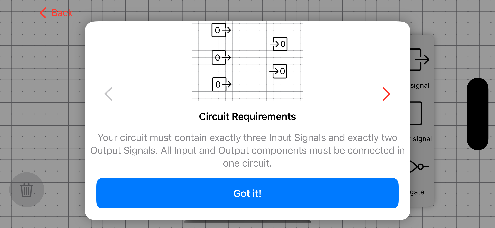
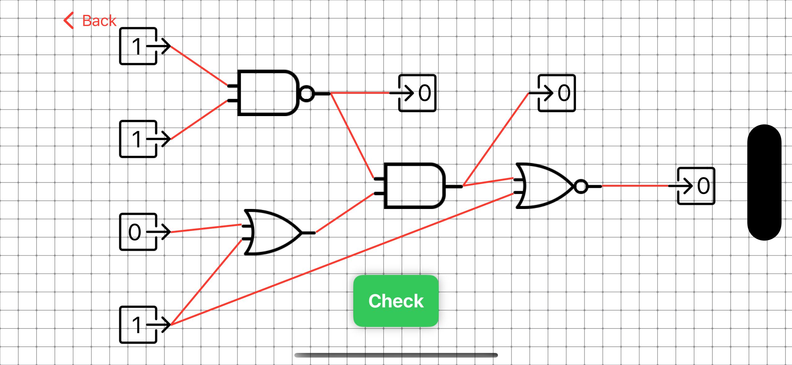
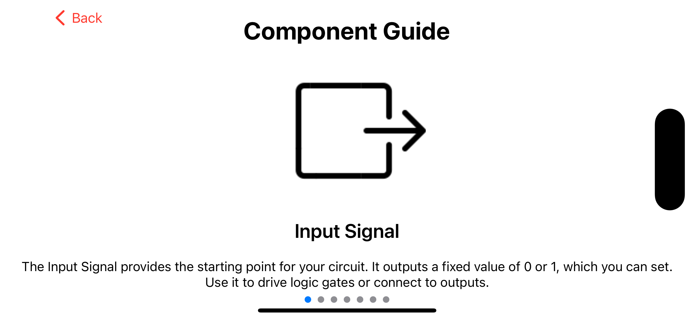
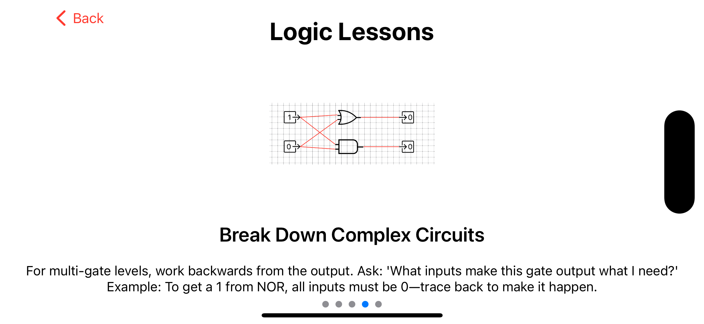

# CircuitCraft

**CircuitCraft** is an interactive logic circuit puzzle game built with SwiftUI. Designed to make digital logic more approachable and engaging, the game challenges players to explore fundamental logic gate concepts through a series of progressively structured puzzles.

With 30 levels, CircuitCraft combines educational content with interactive gameplay, providing a hands-on way to develop logical reasoning and gain a better understanding of digital circuits.

## Features

- **30 Puzzle Levels:** Explore digital logic concepts through a collection of logic circuit challenges.
- **Interactive Learning:** Engage with logic gates through hands-on puzzle-solving rather than passive instruction.
- **Progressive Challenges:** Practice logical reasoning through structured gameplay.
- **Native iOS Interface:** Built using SwiftUI for an interactive user experience.

## Tech Stack

| Technology | Purpose |
|---|---|
| Swift | Core application development |
| SwiftUI | User interface and interactive components |
| `@State` / `@Binding` | State management and data flow |
| Figma | UI/UX design and prototyping |

## Screenshots

*Screenshots of the game interface and gameplay will be added here.*






## Getting Started

### Requirements

- macOS
- Xcode or a compatible version of Swift Playgrounds

### Installation

1. Clone the repository:

   ```bash
   git clone git@github.com:NewtTheBoy/CircuitCraft.git
   ```

2. Open the cloned Swift package using Swift Playgrounds or a compatible version of Xcode.

3. Select an available simulator or supported device.

4. Build and run the application.

## Project Background

CircuitCraft was developed as a personal project to explore native iOS development while combining an interest in digital logic with interactive game design.

The project focuses on translating fundamental computer science concepts into an accessible learning experience through intuitive interfaces and puzzle-based gameplay.
